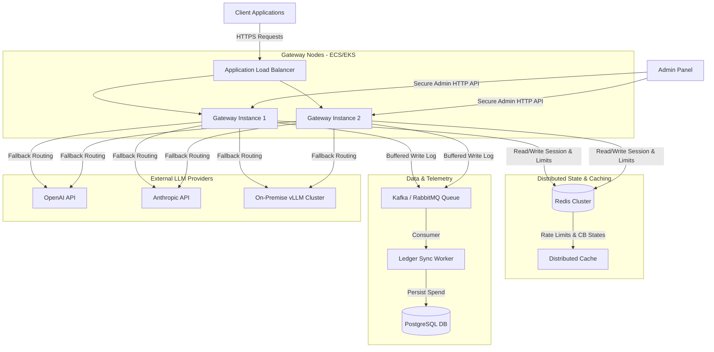

# Enterprise LLM Gateway with Cost Control & Fallback Routing
## Comprehensive Product Audit, Redesign Proposal & Implementation Roadmap

> **Audit Context:** This report represents an end-to-end evaluation of the current LLM Gateway codebase. It evaluates technical limitations, business viability, UX flaws, and architectural scalability, providing a blueprint to transform this prototype into an industry-leading, enterprise-grade SaaS product.

---

## 1. Technical & Product Audit
An examination of the codebase reveals several design vulnerabilities, security gaps, and architectural bottlenecks that prevent this implementation from being production-ready.

### 1.1 — Blocking SQLite I/O on the Async Event Loop
* **File & Lines:** [store.py](file:///e:/Projects/LLM%20Gateway%20with%20Cost%20Control%20&%20Fallback%20Routing/gateway/ledger/store.py#L9-L140)
* **The Flaw:** All database operations (connecting, executing queries, commits) are done using the synchronous `sqlite3` library directly inside the main execution flow. 
* **Why it matters:** FastAPI runs on an asynchronous event loop. Any blocking call (like waiting for disk I/O from SQLite) stops the event loop, meaning *all* concurrent requests are halted during DB operations. Under load, this collapses gateway throughput to a fraction of its potential and multiplies P99 latency.
* **Expected User Impact:** Severe latency spikes and request timeouts when traffic scales.
* **Technical Complexity:** Medium (requires refactoring to an async engine like `databases` with `aiosqlite` or `SQLAlchemy` async driver).
* **Business Impact:** High (poor customer experience, SLA violations).
* **Implementation Priority:** 🔴 **Critical**

### 1.2 — In-Memory Rate Limiting
* **File & Lines:** [auth.py](file:///e:/Projects/LLM%20Gateway%20with%20Cost%20Control%20&%20Fallback%20Routing/gateway/auth.py#L9-L55)
* **The Flaw:** Rate limiting state is stored in an in-memory dictionary `RATE_LIMITS` on the local process.
* **Why it matters:** When deploying the gateway in production, it will run behind a load balancer with multiple worker processes (e.g., Gunicorn/Uvicorn). Since the dictionary is local to each process, client rate limits will be inconsistent (a client could bypass limits by hit-routing to different processes). Furthermore, any restart/deploy wipes the rate-limit state.
* **Expected User Impact:** Inconsistent API limits and vulnerability to DDoS/spam.
* **Technical Complexity:** Low (requires a central key-value store like Redis to track sliding windows).
* **Business Impact:** High (vulnerability to abuse and cloud cost overruns).
* **Implementation Priority:** 🔴 **Critical**

### 1.3 — Plain-Text API Key Leakage in Dashboard
* **File & Lines:** [app.py](file:///e:/Projects/LLM%20Gateway%20with%20Cost%20Control%20&%20Fallback%20Routing/dashboard/app.py#L71-L73)
* **The Flaw:** The Streamlit dashboard selects and displays raw API keys (`SELECT api_key, ...`) from the `budgets` table directly to any user loading the page.
* **Why it matters:** The API keys acting as gateways to paid resources are treated as public metadata. A compromised or poorly secured dashboard exposes customer credentials in plain text.
* **Expected User Impact:** Total compromise of client API keys.
* **Technical Complexity:** Low (hash keys in DB, mask/truncate keys in the UI, e.g., `sk-test...8f2a`).
* **Business Impact:** Critical (massive security breach, legal liabilities).
* **Implementation Priority:** 🔴 **Critical**

### 1.4 — Weak Preflight Cost Estimation
* **File & Lines:** [main.py](file:///e:/Projects/LLM%20Gateway%20with%20Cost%20Control%20&%20Fallback%20Routing/gateway/main.py#L133-L139)
* **The Flaw:** The preflight estimation uses a generic character-to-token fallback approximation (`approx_tokens = content_length / 4`) and multiplies by a hardcoded `$0.001` per 1k tokens, completely ignoring the configured pricing per model/backend.
* **Why it matters:** Expensive models (like GPT-4o or Claude 3.5 Sonnet) cost significantly more than the hardcoded estimate. If a budget-limited client sends a massive request, the preflight check under-estimates the cost and allows it. After execution, the actual cost is logged, which can blow past the client's budget, causing the platform owner to absorb the financial loss.
* **Expected User Impact:** Budgets are bypassed for high-cost requests, exposing businesses to unexpected charges.
* **Technical Complexity:** Medium (requires matching the request model to the pricing listed in `configs/backends.yaml` and running a proper tokenizer like `tiktoken` or a per-model fallback).
* **Business Impact:** High (direct financial risk/leakage).
* **Implementation Priority:** 🔴 **Critical**

### 1.5 — Dummy Health Checks for Cloud Providers
* **File & Lines:** [anthropic_adapter.py](file:///e:/Projects/LLM%20Gateway%20with%20Cost%20Control%20&%20Fallback%20Routing/gateway/adapters/anthropic_adapter.py#L82-L87)
* **The Flaw:** `health_check` in `AnthropicAdapter` simply returns `True` if the API key is present.
* **Why it matters:** The gateway cannot proactively detect if Anthropic's service is down or if the credentials are invalid until a real client request fails.
* **Expected User Impact:** The gateway will attempt to route requests to an unhealthy provider, leading to client latency hits during failovers.
* **Technical Complexity:** Low (implement a lightweight ping, e.g., sending a 0-token completion or querying a fast model list endpoint).
* **Business Impact:** Medium (failover lags behind real outages).
* **Implementation Priority:** 🟠 **High Impact**

---

## 2. User Value Analysis
An enterprise LLM gateway must provide stability, visibility, and cost reduction. Here is an analysis of how the current features address user problems and what is missing.

| Current Feature | User Problem Solved | Realized Value | Feature Gap / Missing Value | Redesign Goal |
|---|---|---|---|---|
| **Multi-Provider Fallback** | Provider downtime causes application outages. | High availability (HA) for LLM access. | It does not handle schema translation (e.g., Anthropic's System Prompt syntax differs from OpenAI's). If a fallback is triggered, the request may reject due to schema mismatch. | Automatically translate system prompts, tool schemas, and output format requests across adapters. |
| **Pre-flight Budget Limit** | Developers writing buggy loops or malicious users draining corporate API keys. | Hard spending ceiling prevents runaway bills. | Lacks dynamic notifications. Users are cut off abruptly without warnings or options to upgrade. | Provide threshold alerts (e.g., webhooks/emails at 80% limit) and support grace-period overdrafts. |
| **Cost-First Routing** | High cost of using premium models (GPT-4o) for simple classification/chat tasks. | Saves money by defaulting to cheaper models. | Blind routing: it might send a highly complex reasoning query to a weak model (e.g., Qwen-0.5B) because it's cheaper, producing useless outputs. | Introduce dynamic, semantic, or metadata-based capability routing that matches query complexity with model capability. |

---

## 3. Feature Gap Analysis
To compete with enterprise tools like LiteLLM, Portkey, or Helicone, the gateway must close key functional gaps:

### 3.1 — Server-Sent Events (Streaming) Support
* **Why it matters:** 90%+ of conversational AI user interfaces rely on streaming (SSE) to lower perceived latency. Blocking requests until the entire response is generated creates a sluggish UX.
* **Expected User Impact:** Interactive apps feel instant instead of waiting 5–15 seconds for a response.
* **Technical Complexity:** High (requires refactoring the adapters to return async generators and configuring FastAPI's `StreamingResponse`).
* **Business Impact:** Critical (mandatory for chat/agentic applications).
* **Priority:** 🔴 **Critical**

### 3.2 — Semantic Response Caching
* **Why it matters:** Many queries in production (e.g., standard customer support questions) are repetitive. Serving them from cache cuts costs to zero and reduces latency to <10ms.
* **Expected User Impact:** Instantaneous response times for repeated queries.
* **Technical Complexity:** High (requires vector embedding of prompts and a similarity lookup in a database like Redis/Pinecone).
* **Business Impact:** High (reduces provider bills by 20–40%).
* **Priority:** 🟠 **High Impact**

### 3.3 — Semantic & Complexity-Based Routing
* **Why it matters:** "Cost-first" routing is too simplistic. An enterprise user needs a router that detects if a query is a simple greeting (route to Qwen-3B) or a complex mathematical proof (route to GPT-4o).
* **Expected User Impact:** Optimal quality-to-cost ratio for every prompt.
* **Technical Complexity:** High (requires a lightweight local classifier or prompt routing heuristics).
* **Business Impact:** High (prevents degradation of output quality while saving cost).
* **Priority:** 🟡 **Medium Impact**

---

## 4. UX/UI Review & Redesign
The current UI is a basic Streamlit script (`dashboard/app.py`) that couples the UI logic with the local SQLite filesystem. 

### 4.1 — Current UX Critical Flaws
1. **No Real-Time Monitoring:** Metrics are rendered statically; there is no WebSockets/SSE-based dashboard showing live requests and circuit breaker states.
2. **Coupled DB Storage:** Because it imports `sqlite3` and reads `ledger.db` directly from the filesystem, it cannot be run in a separate container or virtual machine from the gateway itself without volume sharing.
3. **No Key Management Control:** Budgets are read-only from `budgets.yaml`. There is no visual interface to create, modify, revoke keys, or adjust budgets dynamically.

### 4.2 — Redesign Concept: The Admin Portal
We propose replacing the Streamlit prototype with a React/Next.js dashboard that interacts solely with a secured Gateway Admin API.

```
┌────────────────────────────────────────────────────────┐
│  LLM GATEWAY ADMIN PANEL                      [Active] │
├────────────────────────────────────────────────────────┤
│  SYSTEM STATUS                                         │
│  [ OpenAI: CLOSED ]  [ Anthropic: CLOSED ]  [ Local: ] │
│  🟢 Healthy (12ms)    🟢 Healthy (95ms)    🔴 TRIPPED  │
├────────────────────────────────────────────────────────┤
│  API KEY MANAGEMENT                                    │
│  Key Name      Daily Budget    Used (Today)   Status   │
│  sk-prod-1     $100.00         $45.20 [██░░░] Active   │
│  sk-test-2     $10.00          $9.98  [█████] Blocked  │
│  [+ Create Key]                                        │
├────────────────────────────────────────────────────────┤
│  REAL-TIME METRICS                                     │
│  Cost: $120.40/day | Throughput: 42 rps | Cache: 32%   │
└────────────────────────────────────────────────────────┘
```

---

## 5. System Architecture Review
The current architecture is single-node, tightly coupled to a single local SQLite file, and does not support horizontal scaling.

### 5.1 — Current Data Architecture & Scaling Bottlenecks
* **SQLite Locking:** SQLite only allows a single writer at a time. In a multi-worker environment under heavy concurrent traffic, transactions to log requests and update spend metrics will block each other, causing `database is locked` errors.
* **State Sync:** Circuit breaker status and latency statistics live in local application memory. If multiple gateway instances run behind an ALB, their circuit breaker states will drift, making health failovers inconsistent.

### 5.2 — Redesigned High-Availability Architecture
To support enterprise scaling, the architecture must transition to a distributed model:



---

## 6. AI Opportunities
We can leverage AI features inside the gateway to create unique value:

1. **AI-Driven Routing Agent:** Implement a small, high-speed routing classifier (e.g., running a fine-tuned BERT or Qwen-0.5B model locally in the cluster). The classifier reads the prompt's intent, estimates the required token length, determines model suitability (e.g., code generation vs. basic sentiment analysis), and automatically targets the cheapest model capable of completing the specific task.
2. **Predictive Cost Budgeting:** Analyze a client's historical API usage patterns using a regression model to forecast when they will hit their budget limit, alerting administrators days before an outage.

---

## 7. Business & Market Positioning
### 7.1 — Competitive Landscape
* **LiteLLM:** Excellent open-source tool, but lacks visual administration UI and has complex enterprise onboarding.
* **Portkey / Helicone:** Powerful SaaS tools, but require sending prompt data to third-party clouds, which violates compliance requirements for finance/health enterprises.

### 7.2 — Monetization Strategy
We will employ a **hybrid open-core** model:
1. **Community Edition (Open Source):** Core proxy, basic circuit breakers, cost-first routing, SQLite storage.
2. **Enterprise Edition (Self-Hosted SaaS License):** Distributed PostgreSQL + Redis support, semantic caching, AD/SSO integration, PII masking, administrative UI, and 24/7 SLA.
3. **Managed Cloud SaaS:** A multi-tenant deployment of the gateway hosted by us, charging a small usage fee per request (e.g., $0.05 per 10k tokens routed).

---

## 8. Risk & Compliance Assessment
1. **PII Exposure in Telemetry:** Under regulations like GDPR and HIPAA, logging client prompts/responses directly to the database is a violation if they contain Personal Identifiable Information (PII).
   * *Mitigation:* Integrate an opt-in PII redaction middleware (like Microsoft Presidio) that sanitizes inputs before routing or writing logs to the database.
2. **GDPR Right to Be Forgotten:** If prompts are stored in the cost ledger, users must be able to purge their history.
   * *Mitigation:* Configure retention policies (e.g., prune raw requests after 30 days, keeping only aggregated token/spend counts).

---

## 9. Prioritized Improvements Roadmap

```carousel
### 🔴 Phase 1 — Critical Fixes
1. Refactor raw SQLite connections to use an async connection pool.
2. Replace local memory rate limits and circuit breaker status with Redis.
3. Implement dynamic backend configuration prices in budget checks.
4. Truncate/Mask API keys in all DB read queries and dashboard.
<!-- slide -->
### 🟠 Phase 2 — High Impact
1. Implement Server-Sent Events (SSE) Streaming proxying.
2. Build semantic request caching using Redis.
3. Complete empty integration tests (`test_failover_integration.py` and `test_routing.py`).
4. Decouple Streamlit Dashboard via a REST API.
<!-- slide -->
### 🟡 Phase 3 — Medium Impact
1. Introduce dynamic semantic prompt complexity routing.
2. Add PII redaction and compliance sanitization middleware.
3. Implement administrative API endpoints.
```

---

## 10. System Redesign Proposal

The core design will be restructured into a modular, pluggable pipeline.

```
       Incoming Request
              │
              ▼
   ┌──────────────────────┐
   │    Auth & Api-Key    │  <-- Checks API keys against Redis cache
   └──────────┬───────────┘
              │
              ▼
   ┌──────────────────────┐
   │    Rate Limiter      │  <-- Sliding window check via Redis
   └──────────┬───────────┘
              │
              ▼
   ┌──────────────────────┐
   │    Semantic Cache    │  <-- Vector search (returns match if exists)
   └──────────┬───────────┘
              │ [Miss]
              ▼
   ┌──────────────────────┐
   │ Pre-flight Budget    │  <-- Uses exact pricing configurations
   └──────────┬───────────┘
              │
              ▼
   ┌──────────────────────┐
   │   Router & Failover  │  <-- Evaluates circuit health & ranks backends
   └──────────┬───────────┘
              │
              ▼
   ┌──────────────────────┐
   │   Adapter Execution  │  <-- Normalizes prompts & fetches LLM output
   └──────────┬───────────┘
              │
              ▼
   ┌──────────────────────┐
   │    Ledger Logging    │  <-- Asynchronous logging via message queue
   └──────────────────────┘
```

---

## 11. Implementation Roadmap (Phased Execution)

### 🚀 Phase 1: MVP (Month 1)
* **Goal:** Turn the prototype into a reliable, single-node application.
* **Deliverables:**
  * Async database engine (`aiosqlite`/`SQLAlchemy`).
  * Real tokenizer-based cost estimation.
  * Corrected, masked API key handling.
  * 100% test coverage for failover routing and fallback logic.

### 📈 Phase 2: V1 - Scalable Cluster (Month 2–3)
* **Goal:** Scale the gateway horizontally.
* **Deliverables:**
  * Redis-backed rate limiting and circuit breaker state registry.
  * Server-Sent Events (SSE) streaming support.
  * Central Admin REST API and decoupled Next.js Dashboard.

### 🧠 Phase 3: V2 - Smart Gateway (Month 4–5)
* **Goal:** Lower operational costs and improve routing intelligence.
* **Deliverables:**
  * Semantic caching module.
  * AI-driven prompt complexity classifier.
  * Automatic schema and prompt translation across providers.

### 🏢 Phase 4: Enterprise (Month 6+)
* **Goal:** Governance, compliance, and multi-region resilience.
* **Deliverables:**
  * PII masking and data redaction filters.
  * Multi-region active-active cluster deployment.
  * SSO/SAML integration & SOC2 compliance audits.

---

## 12. Industry Benchmarking

Here is a comparison of this redesigned architecture against market leaders:

| Feature | Redesigned Gateway | LiteLLM | Portkey.ai | Helicone |
|---|---|---|---|---|
| **Primary Focus** | Cost control & high availability | Model routing & SDK compatibility | AI gateway SaaS & observability | Observability & prompt management |
| **Open Source** | Yes (Community Edition) | Yes | Yes (Core) | Yes (Core) |
| **Budget Ceiling** | Pre-flight exact token calculations | Post-flight or simple estimation | Post-flight alerts | Post-flight alerts |
| **Failover Strategy** | Multi-tier circuit breaker with backoff | Fallbacks list | Fallbacks & retries | Retries |
| **Streaming Support** | Async proxy (planned) | Yes | Yes | Yes |
| **Data Privacy** | PII redaction middleware (planned) | No | Requires Cloud SaaS trust | Requires Cloud SaaS trust |

---

### Conclusion & Immediate Next Steps
The audit reveals that the current repository is a promising framework, but it suffers from severe scalability and security constraints. Implementing Phase 1 changes—specifically transitioning DB calls to an async model, locking down API key leakage, and securing rate limits with Redis—will establish a secure, performant foundation for enterprise deployment.
